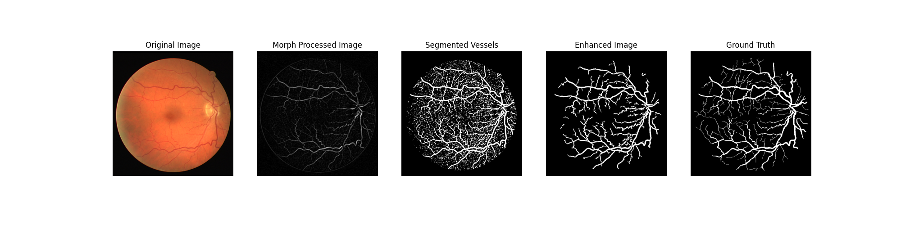

    <h1>Retinal Vessel Detection</h1>
    <h3>Author: Christian Faccio</h3>
    <h5>Email: christianfaccio@outlook.it</h4>
    <h5>Github: <a href="https://github.com/christianfaccio" target="_blank">christianfaccio</a></h5>
    <h6>This project aims at detecting retinal vessels using unsupervised computer vision algorithms. The images used come from the DRIVE dataset.</h6>

---

   

